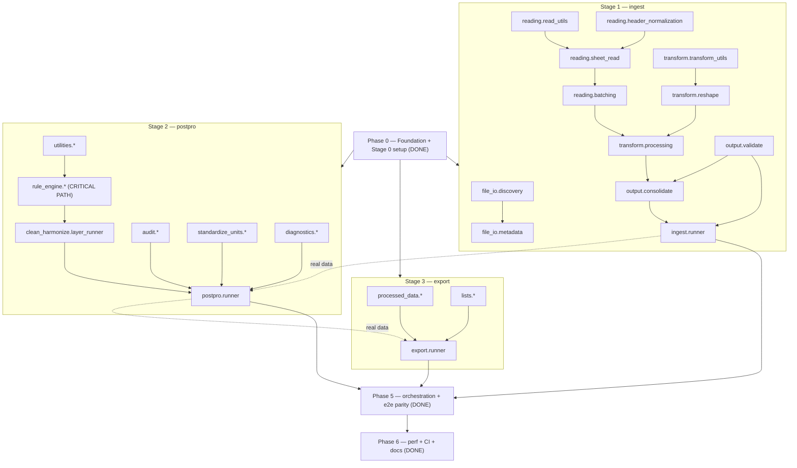

# Migration roadmap

The plan for migrating `whep-digitalization` (R) → `whep-digitize` (Python/polars):
phases, milestones, the dependency DAG, per-module priority/risk/effort, parallel tracks,
and the parity strategy. Companion to [codebase-map.md](codebase-map.md) (per-module status)
and [r-to-python-mapping.md](r-to-python-mapping.md) (how to port + parity risks).

> **Executing this?** [session-prompts.md](session-prompts.md) turns this roadmap into
> ready-to-paste, one-per-session kickoff prompts (recommended workflow: one fresh session
> per module/cluster, driven by the `migrate-module` + `parity-check` skills).

## Guiding principles

1. **Contract-first.** Cross-stage contracts (`contracts.py`) are fixed in Phase 0, so a
   stage can be built and parity-tested against fixtures **before** its upstream stage is
   ported. This is what unlocks parallelism.
2. **Parity is the exit gate.** A module is "done" only when its `@pytest.mark.parity` test
   matches R golden output. Correctness ≥ baseline is non-negotiable.
3. **Bottom-up within a stage.** Leaf helpers before callers (see the DAG).
4. **Critical path = the postpro rule engine.** It is ~half the total effort and gates the
   pipeline end-to-end — start it early, against fixtures, in parallel with ingest.
5. **Parallelizable by design.** Independent modules are migrated by separate agents; the
   roadmap marks which tracks run concurrently.

## Effort unit

A **module-session** = one focused `migrate-module` cycle (read R → implement → test →
parity → gates). Rough sizing by risk: LOW ≈ 0.5, MEDIUM ≈ 1, HIGH ≈ 2 module-sessions.
Totals are estimates for planning, not commitments; **wall-clock is far shorter than the
sum** because tracks run in parallel.

| Phase | Scope | Est. module-sessions |
|-------|-------|----------------------|
| 0 | Foundation + Stage 0 | **done** |
| 1 | Ingest (Stage 1) | ~15–18 |
| 2 | Postpro non-engine (audit, utilities, standardize, diagnostics) | ~14–16 |
| 3 | Postpro rule engine + multi-pass (critical path) | ~14–18 |
| 4 | Export (Stage 3) | ~5–6 |
| 5 | Orchestration, parallelism, progress, end-to-end parity | ~4–6 |
| 6 | Performance, CI hardening, docs finalize | ~3–4 |
| | **Total** | **~55–70** |

---

## Dependency DAG

Solid edges are hard build/dependency order (migrate the source before the target). Dotted
edges are *runtime* data flow only — because contracts are fixed, downstream stages are
built and parity-tested against **fixtures**, so Stages 1/2/3 proceed **in parallel**.

---

## Phases

### Phase 0 — Foundation + Stage 0 — ✅ DONE

Repo, `pyproject.toml` (uv/ruff/mypy/pytest), the full package skeleton, typed contracts,
CLI + orchestrator, and a fully implemented + tested Stage 0 (constants, config,
directories, all helpers). 61 tests, ruff + mypy(strict) green. Docs, guidelines, skills,
and this roadmap.

**Exit (met):** `whep-digitize bootstrap` builds the tree; gates green.

### Phase 1 — Ingest (Stage 1) — ✅ DONE

All modules ported, runner wired, and stage-level parity green on the frozen corpus
(`run_import_pipeline` returns a parity-correct `ImportResult`; sequential == parallel).

**Goal:** `run_import_pipeline(config) -> ImportResult` producing the validated long frame
with parity to R on the fixture corpus.

Milestones (bottom-up, mostly parallel):
- **1a Discovery & metadata** (`discovery`, `metadata`) — LOW/MEDIUM.
- **1b Reading** (`read_utils`, `sheet_read`, **`header_normalization`**, `batching`) —
  header normalization is HIGH (transliteration + ordered regex chain). Do it first with
  golden tests; the rest depend on it.
- **1c Transform** (`transform_utils`, `reshape`, `processing`) — HIGH; the wide→long
  `unpivot` and the fused parallel path. Depends on 1b for real input but can start against
  fixtures immediately.
- **1d Output** (`validate`, `consolidate`) — `validate_long_df_by_document` is HIGH
  (ordering + verbatim error strings). Independent of 1b/1c against fixtures.
- **1e Runner + parallelism** — wire the fused read+transform, sequential first.

**Exit:** ingest runner returns a parity-correct `ImportResult` on the fixture corpus;
sequential and (later) parallel produce identical output.

### Phase 2 — Postpro non-engine — ✅ DONE (Track C)

Audit, utilities, standardize-units, and diagnostics all ported with module + parity tests
(C1–C5 landed 2026-07-22/23). Exit met: audit + standardize + diagnostics parity-correct.

**Goal:** everything in Stage 2 except the rule engine + multi-pass driver. All parallel.
- **2a Audit** (`audit`, `validation`, `config`, `export`) — value→Float64 + retained
  invalid rows + the parse/regex divergence; styled Excel export.
- **2b Utilities** (`output_roots`, `diagnostics`, `templates`, `payload_cache`).
- **2c Standardize units** (`engine` HIGH, `rules_setup`, `aggregation`, `orchestration`) —
  prefix fold + two-stage match + affine convert + aggregation. Self-contained; parallel.
- **2d Diagnostics** (`preflight`, `output`, `rule_summaries`, `standardize_summaries`).

**Exit:** audit + standardize + diagnostics each parity-correct against fixtures.

### Phase 3 — Postpro rule engine + multi-pass (critical path) — ✅ DONE (Track B)

All rule-engine modules + the clean/harmonize multi-pass driver ported (B1–B6). Exit met: clean
and harmonize layers parity-correct on rule fixtures, including multi-pass convergence and
content-hash cycle detection. (The postpro **runner** that calls this — E1 — is Phase 5.)

**Goal:** the algorithmic heart. Bottom-up:
- **3a** `matching_strategy` → `matching_values` (HIGH) → `target_apply` (HIGH).
- **3b** `schema_validation` (MED-HIGH), `payload_application`.
- **3c** `conditional_group` (HIGH) and `footnote_rules` (HIGH, hardest single port).
- **3d** `clean_harmonize.controls_cache` (cycle detection via content hash) +
  `layer_runner` (multi-pass driver) + `stage_inputs`.

**Exit:** clean and harmonize layers parity-correct on rule fixtures, including multi-pass
convergence and cycle detection.

### Phase 4 — Export (Stage 3) — ✅ DONE (2026-07-23)

- **4a** ✅ `processed_data.layers` + `export` (layer detection + fwrite-byte-parity TSV).
- **4b** ✅ `lists.unique_values` + `merge` + `write` (per-column multi-sheet xlsx, identical
  layer merging). `export.runner` (wired, returns `ExportResult`) + `assert_export_paths_contract`.

**Exit:** ✅ processed TSVs and unique-list workbooks parity-correct against fixtures (byte-parity
on TSVs; logical layout — sheet names + values — on xlsx, which no writer reproduces byte-for-byte).

### Phase 5 — Orchestration, parallelism, progress, end-to-end parity — ✅ DONE

- ✅ `run_pipeline` wired through all four real stages.
- ✅ `ProcessPoolExecutor` parallelism in ingest (fused) and list export, order-preserving
  (`executor.map` submission order) and independent of worker count; graceful sequential
  fallback. Workbook `created` date pinned so repeated runs are byte-identical.
- ✅ Gated `rich.progress` bars for each stage runner (`RuntimeOptions.progress_enabled`).
- ✅ **End-to-end parity** on the real (frozen) dataset, first measured **2026-07-24**: R + Python
  run on the same inputs; processed TSV **byte-identical**, unique-list workbooks
  **content-identical** (see the DoD note on workbook bytes). That measurement predates the
  normalization-policy change accepted **2026-07-29**: normalization now implements the NFD
  diacritic-strip POLICY, not R's ICU `Latin-ASCII`, so R-vs-Python output differs **by design**
  wherever a policy-affected string occurs (13 rows on the full **1,339**-workbook dataset; value
  sums and row counts unchanged). Authoritative description:
  [r-to-python-mapping.md](r-to-python-mapping.md) risk #1.
- ✅ **Re-measured 2026-07-30** by the scripted harness `scripts/parity_full_dataset.py` (Part B
  of the parity-automation work), which replaced the unversioned manual diff procedure. Result on
  1,339 workbooks / 592,719 rows: the 13 accepted normalization rows exactly, plus **3 rows of a
  genuine float divergence** (DB3), which the harness correctly rejected. DB3 was **fixed
  2026-07-31** — calamine's lossy float→text coercion at the ingest read, not the conversion
  arithmetic — and the **2026-07-31 re-run exits 0**: 13 accepted rows, 0 rejected, `value` sums
  exactly equal. Full detail: [full-dataset-parity.md](full-dataset-parity.md).

**Exit (met):** `whep-digitize run` produces processed TSVs byte-identical to the R pipeline
(content-identical workbooks) on the frozen dataset, **except for the intentional
normalization-policy divergence** — see the parity-timeline note under *Definition of done*.

### Phase 6 — Performance, CI, docs — ✅ DONE

- ✅ Benchmark harness `.claude/bench/bench.py`; profiled the pipeline (I/O-bound on polars
  `read_excel`, already parallelized; rule engine already polars-vectorized) and vectorized the
  Python-loop hot spots (`canonicalize_semicolon_delimited_cells`, validation error assembly),
  parity preserved. Perf metric enabled in `autocode.toml` (weights re-normalized to sum to 1.0).
- ✅ CI hardened with a 90% coverage gate (`pytest --cov`, `[tool.coverage.report] fail_under`).
  `uv.lock` verified in sync (all deps, incl. `pytest-cov` / `coverage`, locked).
- ✅ Docs finalized; scaffolding notes retired.

---

## Parallel tracks (who can work at once)

Because contracts are fixed and each stage is parity-tested against fixtures, up to **four
tracks run concurrently** after Phase 0:

| Track | Modules | Notes |
|-------|---------|-------|
| A — Ingest | Stage 1 (Phase 1) | Start header_normalization + validate first (both HIGH, independent) |
| B — Rule engine | Stage 2 rule_engine + multi-pass (Phase 3) | **Critical path — start immediately**, against rule fixtures |
| C — Postpro non-engine | audit, standardize_units, diagnostics, utilities (Phase 2) | Each sub-area independent |
| D — Export | Stage 3 (Phase 4) | Smallest; can start against fixtures anytime |

Within a track, the DAG gives the order. Cross-track integration happens in Phase 5.
Recommended sequencing if run by a single developer: **B (rule engine) and A (ingest) first
and in parallel**, then C and D, then Phase 5.

## Priority / risk / effort by module

See the per-module tables in [codebase-map.md](codebase-map.md) (R source + risk). The
HIGH-risk modules — and therefore the ones to schedule first within their track and to
give the most parity scrutiny — are:

- Ingest: `header_normalization`, `transform_utils`, `reshape`, `processing`, `validate`.
- Rule engine: `matching_values`, `target_apply`, `conditional_group`, `footnote_rules`,
  `layer_runner`, `controls_cache`.
- Standardize: `engine`.

## Parity strategy

0. **Know which dataset a claim is about.** The **fixture corpus** (`tests/fixtures/corpus/`,
   **6 workbooks**, committed) backs the routine CI suite; the **full production dataset**
   (`data/import/raw/`, **1,339 workbooks** as of 2026-07-30, growing) backs the end-to-end
   claim and needs R. See [architecture.md](architecture.md) → *Datasets*.
1. **Freeze inputs.** The live dataset grows; snapshot a fixed corpus (plus small synthetic
   fixtures covering edge cases) for all A/Bs and parity tests.
2. **Golden files from R.** Use the `parity-check` skill to run the R function and save
   outputs under `tests/golden/<module>/`. Goldens are committed alongside their generating
   fixtures — that is what lets CI run the parity suite without an R install.
3. **Module-level parity** during each port (`@pytest.mark.parity`), then **stage-level**,
   then **end-to-end** in Phase 5.
4. **Normalization** follows the documented POLICY (NFD diacritic strip), NOT R's ICU
   `Latin-ASCII` — divergence on symbols/ligatures is intentional; pin it with policy tests.

### Accepted limitation — stage goldens replicate the R orchestration inline

The `import_stage` and `postpro_stage` captures in `tests/parity/registry.py` do **not** call R's
real entry points. Their preambles (`_STAGE_PREAMBLE`, `_POSTPRO_STAGE_PREAMBLE`) reconstruct the
orchestration by calling the same underlying R leaf functions in sequence.

**Why the real entry points cannot be captured.** `run_import_pipeline()` and
`run_postpro_pipeline_batch()` are structurally hostile to a golden-capture harness: they
auto-source their stage scripts through `here::here()` (which requires the R project root as cwd,
whereas the harness sources by absolute path so captures are cwd-independent), they **auto-run at
`source()` time** via `run_import_pipeline_auto()` / `run_postpro_pipeline_auto()`, they publish
results into `.GlobalEnv` through `assign_environment_values()` instead of returning them to a
caller the harness can bind, and they read/write checkpoints against a real `config$paths` tree
that the harness replaces with a minimal list over the committed fixtures.

**What this does and does not buy.** The leaf functions invoked in the preambles *are* the real R
ones, so per-step behaviour is genuinely pinned by execution. What is **not** pinned is the
**orchestration wiring** — step order, what feeds what, and where the canonical sorts fall. A
divergence between the reconstruction and R's actual runner would yield a self-consistent, and
therefore green, golden. **The wiring is verified by review against the R source, not by
execution**, and that review must be repeated whenever either R runner changes.

One further caveat, specific to postpro: the preamble hand-inlines step 1
(`audit_data_output()`) as `copy(raw)` + `readr::parse_double(value)`, because the real function
requires an audit output root and writes a styled workbook. That is the single place where a
*leaf* function is reimplemented rather than invoked, so it carries the same review obligation.

**Review status — 2026-07-30 (both sequences match):**

| | Verified against | Result |
|---|---|---|
| `ingest/runner.py` | `r/1-import_pipeline/run_import_pipeline.R` | matches on every data-affecting step |
| `_STAGE_PREAMBLE` | same | matches; omits only checkpoint, script sourcing, the zero-file abort, worker/`future::plan` resolution, and progress |
| `postpro/runner.py` | `r/2-postpro_pipeline/run_postpro_pipeline.R` | matches all 9 steps, including the three post-layer sorts |
| `_POSTPRO_STAGE_PREAMBLE` | same | executes steps 6–8 with the real leaves; inlines step 1 (verified equivalent to its return value); omits steps 2–5 and 9, none of which mutate the frames |

Known non-output divergences found by that review, recorded rather than "fixed": the import
runner's four post-read progress ticks use different labels and anchor points than R's (R:
`reading` → *reads* → `transforming`/`splitting`/`validating`; Python: *reads* →
`dropping`/`validating`/`splitting`/`sorting`, and `splitting` reads "consolidating validation
groups" vs R's "splitting validation groups") — both budgets still total `2n + 4`, and progress
text reaches no output artifact. R also asserts `assert_directory_exists()` on the raw import
folder before loading the checkpoint; Python surfaces a missing folder as the empty-folder
`ValidationError` instead — same abort, different message.

## Risks & mitigations

| Risk | Mitigation |
|------|------------|
| Transliteration divergence silently breaks rule matching | Resolved by decision (2026-07-29): normalization follows the POLICY, not ICU — pin it with policy tests, **no** character-specific overrides; impact bounded and recorded (~13 rows, sums/counts unchanged) |
| `melt`→`unpivot` drops/keeps different columns | Recompute year columns explicitly; assert column set in parity tests |
| Non-deterministic ordering across workers | `sort_pipeline_stage_df` everywhere; parity test sequential vs parallel |
| Rule-engine complexity (7 HIGH modules) underestimated | Start earliest; migrate strictly bottom-up; heavy fixture coverage per module |
| R `serialize()` cycle detection has no portable analogue | Replace with deterministic content hash; rely on the cheap `changed_value_count==0` early stop as primary convergence signal |
| Live dataset drift invalidates goldens | Freeze the corpus; regenerate goldens only on an intentional, recorded refresh |

## Definition of done (whole migration) — ✅ met

`whep-digitize run` on the full production dataset reproduces the R pipeline's output
**byte-identical to R except for the intentional normalization-policy divergence** (13 rows;
value sums and row counts unchanged).

**Which dataset:** every claim below is about the **full production dataset** —
**1,339 workbooks**, 592,719 harmonized rows (measured 2026-07-31). The 6-workbook fixture corpus
backs the CI suite, not these claims. See [architecture.md](architecture.md) → *Datasets*.

- ✅ **Processed TSVs byte-identical** to R (`data.table::fwrite` vs polars `write_csv`) **apart
  from the normalization-policy divergence**. First verified **2026-07-24** (then 742 workbooks /
  265,231 rows / 31,354,078 bytes — a pre-policy-change measurement); **re-verified 2026-07-31**
  on 1,339 workbooks / 592,719 rows by `scripts/parity_full_dataset.py`, which exits 0 with 13
  accepted rows, 0 rejected, and exactly equal `value` sums.
- ✅ **No open defects.** The one the harness caught (DB3 — 3 rows where R wrote
  `99.9999999999996` and Python `100`) was **fixed 2026-07-31**: the cause was calamine rounding
  a stored double to ~12 significant digits when coercing it to text at the ingest read, which a
  later `x1000` standardization amplified. `ingest/reading/sheet_read.py` now restores the exact
  stored value; see [full-dataset-parity.md](full-dataset-parity.md).
- ✅ **Unique-list workbooks content-identical** — every sheet and cell, with the normalization
  carve-out: `unique_polity.xlsx` has 5 fewer rows because the five policy-affected values
  collapse onto entries Python already had. The other 9 workbooks match exactly. Raw-byte
  identity is *not achievable* across R `writexl` and Python `xlsxwriter` (different ZIP
  writers), so content-identity is the workbook parity target; the Python workbooks are
  byte-reproducible run-to-run (pinned `created` date).
- ✅ **Module + stage + e2e tests pass** — module parity + stage parity (`import_stage`,
  `postpro_stage`) in `tests/parity/`, plus the `run_pipeline` end-to-end integration test
  (`tests/test_pipeline_e2e.py`). The R-parity suite stays green because normalization is no
  longer held to R: the `string_normalization` spec was removed and the `header_normalization` /
  `matching` fixtures were trimmed of ICU-divergent inputs, which are now pinned by policy tests
  (`tests/setup/test_helpers.py`) instead of R goldens.
- ✅ **Full-dataset parity is automated, not manual** — `scripts/parity_full_dataset.py` plus the
  opt-in `pytest -m slow` wrapper replaced the unversioned manual diff procedure. See
  [full-dataset-parity.md](full-dataset-parity.md).
- ✅ **ruff + ruff format + mypy(strict) + pytest green in CI**, with a 90% coverage gate.
- ✅ **`uv.lock` committed** and in sync with `pyproject.toml`.
- ✅ **Docs current** (this file, `codebase-map`, `r-to-python-mapping`, `constants-and-options`,
  `full-dataset-parity`).

> **Parity timeline.** Byte-identity was verified **2026-07-24**, *before* the change that
> intentionally broke it. On **2026-07-29** string/header normalization was switched to the
> documented POLICY — NFD diacritic strip + lowercase + drop non-alphanumerics — instead of R's
> ICU `Latin-ASCII`, and the resulting divergence was **accepted**: on the full **1,339**-workbook
> dataset the harmonize output differs from R in **13 rows**, all of them ICU's `®`→`(R)`
> expansion (`philippines r`→`philippines` ×4, `uruguay r`→`uruguay` ×4, `nicaragus r` ×2,
> `brazil r` ×2, `australia r` ×1), while **value sums and row counts are unchanged**. On
> **2026-07-30** this was re-measured by script and confirmed at exactly 13 rows — and the same
> run surfaced DB3, an unrelated 3-row float divergence, fixed **2026-07-31**. The authoritative
> description of the policy and its exact impact is
> [r-to-python-mapping.md](r-to-python-mapping.md) risk #1; the harness and its results are
> documented in [full-dataset-parity.md](full-dataset-parity.md).

The migration is **complete**: the only remaining R-vs-Python difference is the intentional
normalization-policy divergence.
